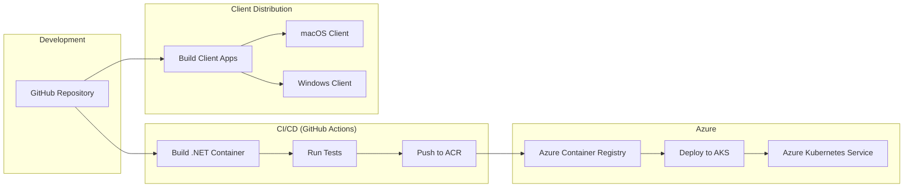

# SauronVisionProtocol (SVP)

A proof-of-concept TCP/IP protocol implementation in .NET 9 with Lord of the Rings / Sauron theming, deployed on Azure Kubernetes Service via GitHub Actions.  Joe Reger just playing around here.

## Project Overview

SauronVisionProtocol (SVP) demonstrates a custom TCP/IP protocol implementation with a thematic twist. This project creates a client-server system where:

- The server runs as a containerized .NET 9 application on Azure Kubernetes Service (AKS)
- Clients connect and communicate using Lord of the Rings / Sauron-themed commands
- Deployment is fully automated via GitHub Actions

The protocol transforms technical networking concepts into an engaging, themed experience while showcasing modern cloud-native development practices.

## Technology Stack

### Server-Side
- **.NET 9**: Modern, high-performance framework for building server applications
- **Azure Kubernetes Service (AKS)**: For containerized deployment and orchestration
- **Docker**: Linux-based containers for consistent deployment
- **GitHub Actions**: CI/CD automation
- **Azure Container Registry (ACR)**: For storing and versioning Docker images

### Client-Side
- Cross-platform client applications (specific framework TBD)
- Initial focus on macOS development with Windows support planned

## Project Structure

```
SauronVisionProtocol/
├── .github/
│   └── workflows/           # GitHub Actions workflow definitions
├── docs/                    # Documentation
│   ├── protocol/            # Protocol specification
│   ├── setup/               # Setup instructions
│   └── azure/               # Azure configuration guides
├── memory-bank/             # Project memory/documentation
├── server/                  # .NET 9 server implementation
│   ├── src/                 # Source code
│   ├── tests/               # Unit and integration tests
│   ├── Dockerfile           # Container definition
│   └── kubernetes/          # Kubernetes deployment manifests
├── client/                  # Client applications
│   ├── common/              # Shared protocol handler code
│   ├── macos/               # macOS-specific implementation
│   └── windows/             # Windows-specific implementation
├── .gitignore
└── README.md                # This file
```

## Deployment Architecture

The project employs a cloud-native deployment strategy with a fully automated CI/CD pipeline:



### Deployment Process

1. **Code Push**: Developer pushes code to GitHub repository
2. **Automated Build**: GitHub Actions automatically triggers container build
3. **Testing**: Automated tests run against the built container
4. **Registry Push**: Successfully tested container is pushed to Azure Container Registry
5. **Kubernetes Deployment**: Updated container is deployed to AKS
6. **Verification**: Automated smoke tests verify successful deployment

This deployment approach is especially important as development happens on macOS without all runtimes installed locally.

## Development Workflow

Since development occurs on macOS without all required runtimes, the workflow is designed to leverage cloud resources:

1. **Local Development**: Code is written and initially validated locally
2. **Push to Repository**: Changes are pushed to GitHub
3. **CI/CD Pipeline**: Automated pipeline builds, tests, and deploys changes
4. **Testing in Cloud**: Testing occurs in the cloud environment
5. **Feedback Loop**: Results inform the next iteration of development

This approach ensures consistent testing and deployment regardless of local development environment limitations.

## Setup Instructions

### Prerequisites

- Visual Studio Code
- Git
- Azure Account and CLI
- Docker Desktop (optional for local testing)
- .NET 9 SDK (for local development)

### Initial Setup

1. Clone the repository:
   ```bash
   git clone https://github.com/your-org/SauronVisionProtocol.git
   cd SauronVisionProtocol
   ```

2. Configure Azure credentials:
   ```bash
   az login
   ```

3. (Optional) For local development with Docker:
   ```bash
   docker build -t svp-server:dev ./server
   docker run -p 9000:9000 svp-server:dev
   ```

4. For full setup of AKS and deployment pipeline, refer to [detailed setup documentation](docs/setup/README.md)

## Protocol Description

The SauronVisionProtocol uses a text-based format for commands and responses:

### Commands
```
[COMMAND_NAME] [PARAM1] [PARAM2] ... [PARAMn]
```

Example commands:
```
PALANTIR_GAZE gondor
EYE_OF_SAURON 10 30
RING_COMMAND nazgul attack
```

### Responses
```
[STATUS_CODE] [RESPONSE_TYPE] [MESSAGE]
```

Example response:
```
200 VISION_GRANTED "The eye of Sauron turns to Gondor. Armies of 5000 orcs detected."
```

A full protocol specification is under development.

## License

[License information to be determined]

## Contributing

Contribution guidelines will be added as the project progresses.
