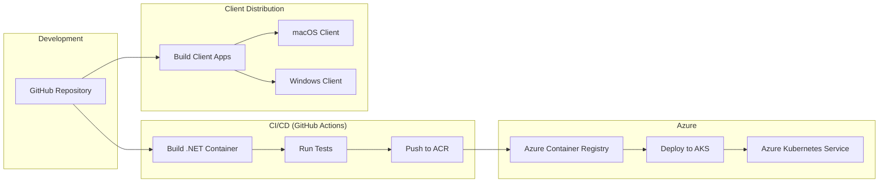

# SauronVisionProtocol (SVP)

A proof-of-concept TCP/IP protocol implementation in .NET 9 with Lord of the Rings / Sauron theming of a MAUI desktop app, deployed on Azure Kubernetes Service via GitHub Actions.  Vibe codin' with Cline inside of VSCode using a combo of Claude 3.7 Sonnet and Gemini 2.5 Pro models... it goes without saying that you should use any of this code at your own risk. 

## Project Overview

SauronVisionProtocol (SVP) demonstrates a custom TCP/IP protocol implementation with a thematic twist. This project creates a client-server system where:

- The server runs as a containerized .NET 9 application on Azure Kubernetes Service (AKS)
- Clients connect and communicate using Lord of the Rings / Sauron-themed commands
- Cross-platform desktop client built with .NET MAUI provides a technical view of the protocol
- Deployment is fully automated via GitHub Actions

The protocol transforms technical networking concepts into an engaging, themed experience while showcasing modern cloud-native development practices. The initial implementation focuses on a simple command set and deployment pipeline, which will be expanded upon once the infrastructure is proven.

## Technology Stack

### Server-Side
- **.NET 9**: Modern, high-performance framework for building server applications
- **Azure Kubernetes Service (AKS)**: For containerized deployment and orchestration
- **Docker**: Linux-based containers for consistent deployment
- **GitHub Actions**: CI/CD automation
- **Azure Container Registry (ACR)**: For storing and versioning Docker images

### Client-Side
- **.NET MAUI**: Cross-platform UI framework for Windows and macOS applications
- **Protocol Visualization Components**: For monitoring raw TCP/IP communication
- **Three-Panel Layout**: Client interface, protocol visualization, and server responses

## Project Structure

```
SauronVisionProtocol/
├── .github/
│   └── workflows/           # GitHub Actions workflow definitions
├── docs/                    # Documentation
│   ├── protocol/            # Protocol specification
│   ├── setup/               # Setup instructions
│   └── azure/               # Azure configuration guides
├── memory-bank/             # Project memory/documentation
├── server/                  # .NET 9 server implementation
│   ├── src/                 # Source code
│   ├── tests/               # Unit and integration tests
│   ├── Dockerfile           # Container definition
│   └── kubernetes/          # Kubernetes deployment manifests
├── client/                  # Client applications
│   ├── src/                 # .NET MAUI application source
│   ├── tests/               # Client tests
│   └── protocol/            # Protocol implementation
├── shared/                  # Shared code between client and server
│   └── protocol/            # Protocol definitions
├── .gitignore
└── README.md                # This file
```

## Deployment Architecture

The project employs a cloud-native deployment strategy with a fully automated CI/CD pipeline:



### Deployment Process

1. **Code Push**: Developer pushes code to GitHub repository
2. **Automated Build**: GitHub Actions automatically triggers container build
3. **Testing**: Automated tests run against the built container
4. **Registry Push**: Successfully tested container is pushed to Azure Container Registry
5. **Kubernetes Deployment**: Updated container is deployed to AKS
6. **Verification**: Automated smoke tests verify successful deployment

This deployment approach is especially important as development happens on macOS without all runtimes installed locally.

## Development Workflow

Since development occurs on macOS without all required runtimes, the workflow is designed to leverage cloud resources:

1. **Local Development**: Code is written and initially validated locally
2. **Push to Repository**: Changes are pushed to GitHub
3. **CI/CD Pipeline**: Automated pipeline builds, tests, and deploys changes
4. **Testing in Cloud**: Testing occurs in the cloud environment
5. **Feedback Loop**: Results inform the next iteration of development

This approach ensures consistent testing and deployment regardless of local development environment limitations.

## Client Interface

The client application features a three-panel layout:

```
+----------------+------------------+------------------+
|                |                  |                  |
|  CLIENT        |  PROTOCOL        |  SERVER          |
|  (Command      |  (Network        |  (Sauron's       |
|   Interface)   |   Visualization) |   Responses)     |
|                |                  |                  |
+----------------+------------------+------------------+
```

- **Left Panel**: Client interface for entering commands and managing connection
- **Middle Panel**: Protocol visualization showing the raw TCP/IP data flowing between client and server
- **Right Panel**: Server responses with Sauron-themed formatting

This design allows technical users to see both the themed interface and the underlying protocol details simultaneously.

## Setup Instructions

### Prerequisites

- Visual Studio Code
- Git
- Azure Account and CLI
- Docker Desktop (optional for local testing)
- .NET 9 SDK (for local development)
- .NET MAUI workload and SDK

### Initial Setup

1. Clone the repository:
   ```bash
   git clone https://github.com/your-org/SauronVisionProtocol.git
   cd SauronVisionProtocol
   ```

2. Configure Azure credentials:
   ```bash
   az login
   ```

3. (Optional) For local development with Docker:
   ```bash
   docker build -t svp-server:dev ./server
   docker run -p 9000:9000 svp-server:dev
   ```

4. For full setup of AKS and deployment pipeline, refer to [detailed setup documentation](docs/setup/README.md)

## Protocol Description

The SauronVisionProtocol uses a text-based format for commands and responses:

### Commands
```
[COMMAND_NAME] [PARAM1] [PARAM2] ... [PARAMn]
```

Initial implementation will focus on a single simple command:
```
PALANTIR_GAZE [location]
```

Additional commands will be added as the project progresses:
```
EYE_OF_SAURON [intensity] [duration]
RING_COMMAND [minion_type] [action]
```

### Responses
```
[STATUS_CODE] [RESPONSE_TYPE] [MESSAGE]
```

Example response:
```
200 VISION_GRANTED "The eye of Sauron turns to Gondor. Armies of 5000 orcs detected."
```

The protocol will be visualized in the client application, showing the raw TCP/IP data alongside the formatted commands and responses.

## Development Approach

The initial development will focus on:

1. **Infrastructure Setup**: Establishing the AKS and ACR resources
2. **CI/CD Pipeline**: Implementing GitHub Actions for automated deployment
3. **Simple Server**: Basic TCP/IP server with a single command implementation
4. **Basic Client**: Minimal .NET MAUI interface with the three-panel layout

This approach allows us to focus on getting the deployment pipeline working correctly before adding complexity to the application logic.

## License

[License information to be determined]

## Contributing

Contribution guidelines will be added as the project progresses.
