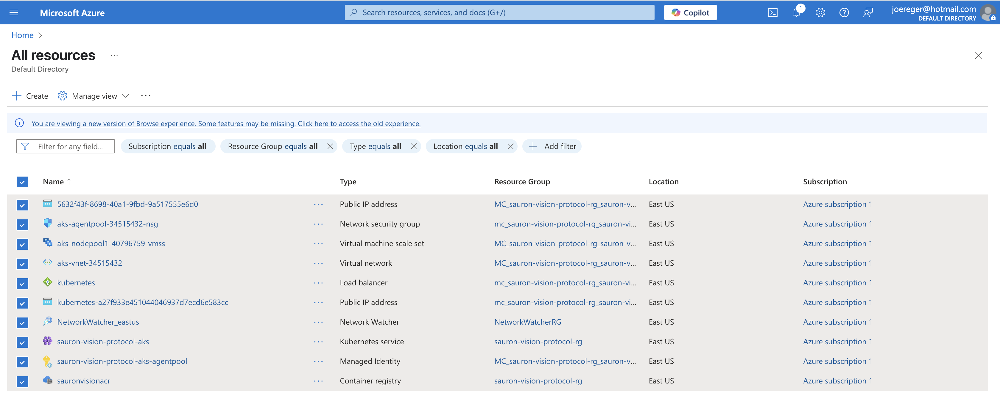
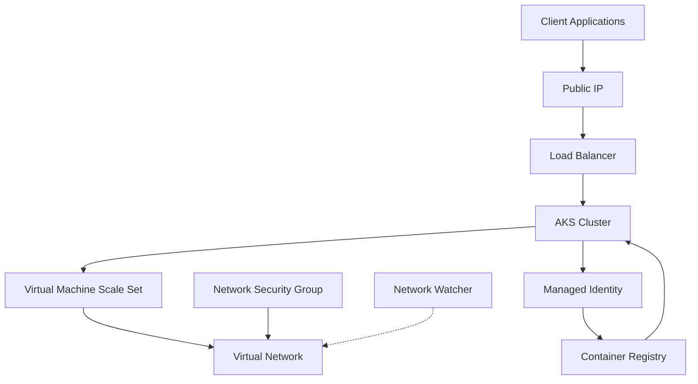

# Azure Resources for SauronVisionProtocol

This document provides a detailed overview of the Azure resources deployed to host the SauronVisionProtocol application. Each resource plays a specific role in enabling the containerized deployment of the application on Azure Kubernetes Service (AKS).



## Resource Overview

The SauronVisionProtocol application uses a modern cloud-native architecture built on Azure Kubernetes Service. The following resources work together to form a complete, secure, and scalable hosting environment:

| Resource Name | Type | Purpose |
|--------------|------|---------|
| 5632f43f-8698-40a1-9fbd-9a517555e6d0 | Public IP address | External IP for incoming traffic |
| kubernetes-a27f933e45104404697d7ecf6e583cc | Public IP address | Kubernetes LoadBalancer service external IP |
| aks-agentpool-34515432-nsg | Network security group | Firewall rules for AKS node pool |
| aks-nodepool1-40796759-vmss | Virtual machine scale set | Compute resources for AKS nodes |
| aks-vnet-34515432 | Virtual network | Isolated network for AKS cluster |
| kubernetes | Load balancer | Routes external traffic to appropriate pods |
| NetworkWatcher_eastus | Network Watcher | Monitors network traffic and diagnostics |
| sauron-vision-protocol-aks | Kubernetes service | Orchestrates containerized applications |
| sauron-vision-protocol-aks-agentpool | Managed Identity | Securely access other Azure resources |
| sauronvisionacr | Container registry | Stores Docker container images |

## Detailed Resource Explanations

### Public IP Addresses

Two public IP addresses are provisioned for the deployment:

1. **5632f43f-8698-40a1-9fbd-9a517555e6d0**: 
   - **Role**: Provides a static, dedicated IP address for inbound connections to the application
   - **Azure Context**: Public IP resources in Azure allow resources to communicate with the internet, on-premises networks, or other Azure services
   - **Project Integration**: This is the entry point for client applications to connect to the SauronVisionProtocol server

2. **kubernetes-a27f933e45104404697d7ecf6e583cc**:
   - **Role**: Assigned to the Kubernetes load balancer service
   - **Azure Context**: When a Kubernetes service of type `LoadBalancer` is created, Azure automatically provisions a public IP address
   - **Project Integration**: This IP is used by the Kubernetes load balancer to distribute traffic to pods running the SauronVisionProtocol server

### Network Security Group (aks-agentpool-34515432-nsg)

- **Role**: Acts as a virtual firewall for AKS node VMs by controlling inbound and outbound traffic based on security rules
- **Azure Context**: Network Security Groups contain security rules that allow or deny inbound/outbound traffic based on source/destination IP addresses, ports, and protocols
- **Project Integration**: Secures the AKS cluster by only allowing necessary traffic for the SauronVisionProtocol application, specifically TCP port 9000 based on the protocol requirements

### Virtual Machine Scale Set (aks-nodepool1-40796759-vmss)

- **Role**: Provides the underlying compute resources that host the Kubernetes nodes
- **Azure Context**: Virtual Machine Scale Sets allow you to create and manage a group of identical, load-balanced VMs that can automatically scale up or down based on demand
- **Project Integration**: Hosts the Kubernetes nodes that run the SauronVisionProtocol container images. The scale set allows the cluster to dynamically add or remove nodes based on resource demands

### Virtual Network (aks-vnet-34515432)

- **Role**: Provides network isolation for the AKS cluster
- **Azure Context**: Virtual Networks enable Azure resources to securely communicate with each other, the internet, and on-premises networks
- **Project Integration**: Isolates the SauronVisionProtocol Kubernetes pods within a private network while allowing controlled external access through the load balancer

### Load Balancer (kubernetes)

- **Role**: Distributes incoming network traffic across multiple pods running the SauronVisionProtocol server
- **Azure Context**: Azure Load Balancer is a Layer-4 (TCP, UDP) load balancer that distributes incoming traffic among healthy instances
- **Project Integration**: Ensures high availability of the SauronVisionProtocol server by routing client connections to healthy instances and performing health checks

### Network Watcher (NetworkWatcher_eastus)

- **Role**: Monitors, diagnoses, and provides insights into network traffic and health
- **Azure Context**: Network Watcher provides tools to monitor, diagnose, view metrics, and enable or disable logs for resources in an Azure virtual network
- **Project Integration**: Helps troubleshoot connection issues with the SauronVisionProtocol application by monitoring network flows and diagnostic logs

### Kubernetes Service (sauron-vision-protocol-aks)

- **Role**: Provides the container orchestration platform that hosts the SauronVisionProtocol application
- **Azure Context**: Azure Kubernetes Service (AKS) is a managed Kubernetes service that simplifies deploying, managing, and scaling containerized applications
- **Project Integration**: Orchestrates the deployment, scaling, and management of the SauronVisionProtocol server containers. It handles pod scheduling, container restarts, scaling, and updates based on the Kubernetes manifests in the project

### Managed Identity (sauron-vision-protocol-aks-agentpool)

- **Role**: Provides a secure identity for AKS nodes to access other Azure resources (like pulling images from ACR)
- **Azure Context**: Managed identities eliminate the need for developers to manage credentials by providing Azure services with an automatically managed identity in Azure AD
- **Project Integration**: Allows the AKS cluster to securely access the Azure Container Registry (sauronvisionacr) without storing credentials in the deployment configuration

### Container Registry (sauronvisionacr)

- **Role**: Stores and manages the Docker container images for the SauronVisionProtocol server
- **Azure Context**: Azure Container Registry is a managed, private Docker registry service for storing and managing container images
- **Project Integration**: This is where the CI/CD pipeline pushes built Docker images that are then pulled by the AKS cluster when deploying the application

## How Resources Work Together

The SauronVisionProtocol application deployment follows this workflow:

1. **Image Storage and Management**:
   - The GitHub Actions CI/CD pipeline builds Docker images and pushes them to **sauronvisionacr** (Azure Container Registry)

2. **Deployment to Kubernetes**:
   - The Kubernetes cluster (**sauron-vision-protocol-aks**) pulls images from the container registry using its **Managed Identity**
   - The cluster schedules pods across nodes in the **Virtual Machine Scale Set**

3. **Network Configuration**:
   - Pods run within the isolated **Virtual Network**
   - The **Network Security Group** controls traffic to and from the nodes
   - **Network Watcher** monitors traffic for troubleshooting

4. **External Access**:
   - The Kubernetes **Load Balancer** service is assigned a **Public IP Address**
   - Incoming client traffic reaches the application through this public IP
   - Traffic is distributed to healthy pods running the SauronVisionProtocol server

5. **Scaling and Management**:
   - The **Virtual Machine Scale Set** can automatically scale the number of nodes based on demand
   - Kubernetes handles pod scaling and distribution across the available nodes

## Resource Dependencies



This architecture provides a highly available, scalable, and secure environment for running the SauronVisionProtocol application.

## Security Considerations

The deployment incorporates several security best practices:

1. **Network Isolation**: The AKS cluster runs in its own virtual network
2. **Network Security Groups**: Control traffic to and from the AKS nodes
3. **Managed Identities**: Avoid storing credentials for accessing ACR
4. **Private Container Registry**: Container images are stored in a private registry

## Architectural Diagram

The following diagram illustrates the complete architecture of the SauronVisionProtocol deployment on Azure, showing how all components connect and interact:

```
                                                  Azure Cloud
┌──────────────────────────────────────────────────────────────────────────────────────────────────────┐
│                                                                                                      │
│                          ┌───────────────────┐                                                       │
│                          │   Azure DevOps    │                                                       │
│                          │   GitHub Actions  │                                                       │
│                          └─────────┬─────────┘                                                       │
│                                    │                                                                 │
│                                    │ Push                                                            │
│                                    ▼                                                                 │
│    ┌────────────────────────────────────────────────┐                                               │
│    │                                                │                                               │
│    │        Azure Container Registry                │                                               │
│    │        (sauronvisionacr)                       │                                               │
│    │                                                │                                               │
│    └─────────────────────┬──────────────────────────┘                                               │
│                          │                                                                           │
│                          │ Pull                                                                      │
│                          │                                                                           │
│    ┌─────────────────────▼──────────────────────────┐         ┌────────────────────────────┐        │
│    │                                                │         │                            │        │
│    │   Azure Kubernetes Service                     │         │  Managed Identity          │        │
│    │   (sauron-vision-protocol-aks)                 │◄────────►  (aks-agentpool)           │        │
│    │                                                │         │                            │        │
│    └───────┬──────────────────────────────┬─────────┘         └────────────────────────────┘        │
│            │                              │                                                          │
│            │                              │                                                          │
│            ▼                              ▼                                                          │
│    ┌───────────────────┐         ┌───────────────────┐                                              │
│    │                   │         │                   │                                              │
│    │   Node Pool VMSS  │         │   Virtual Network │◄───────┐                                     │
│    │  (aks-nodepool1)  │         │  (aks-vnet)       │        │                                     │
│    │                   │         │                   │        │                                     │
│    └───────┬───────────┘         └─────────┬─────────┘        │                                     │
│            │                               │                  │                                     │
│            │                               │                  │                                     │
│            │                               ▼                  │                                     │
│            │                     ┌───────────────────┐        │                                     │
│            │                     │                   │        │                                     │
│            │                     │ Network Security  │────────┘                                     │
│            │                     │   Group (NSG)     │                                              │
│            │                     │                   │                                              │
│            │                     └───────────────────┘                                              │
│            │                                                                                        │
│            ▼                                                                                        │
│    ┌───────────────────┐                                                                            │
│    │  Pods running     │                                                                            │
│    │  SauronVision     │                                                                            │
│    │  Protocol         │                                                                            │
│    └─────────┬─────────┘                                                                            │
│              │                                                                                      │
│              │                  ┌───────────────────┐                                               │
│              │                  │                   │                                               │
│              └─────────────────►│  Load Balancer    │                                               │
│                                 │  (kubernetes)     │                                               │
│                                 │                   │                                               │
│                                 └─────────┬─────────┘                                               │
│                                           │                                                         │
│                                           │                                                         │
│                                 ┌─────────▼─────────┐                                               │
│                                 │                   │                                               │
│                                 │   Public IP       │                                               │
│                                 │                   │                                               │
│                                 └─────────┬─────────┘                                               │
│                                           │                                                         │
└───────────────────────────────────────────┼─────────────────────────────────────────────────────────┘
                                            │
                                            │
                                  ┌─────────▼─────────┐
                                  │                   │
                                  │  External Clients │
                                  │                   │
                                  └───────────────────┘
```

The diagram above shows:

1. **CI/CD Pipeline**: GitHub Actions builds and pushes container images to the Azure Container Registry
2. **Image Storage**: Azure Container Registry stores the Docker images
3. **Orchestration**: AKS pulls images and runs them as containers in pods
4. **Compute Resources**: Virtual Machine Scale Sets provide the underlying nodes for Kubernetes
5. **Networking**: Virtual Network, NSG, and Load Balancer handle network traffic and security
6. **Identity**: Managed Identity enables secure access to resources without credentials
7. **External Access**: Public IP exposes the service to external clients

This architecture demonstrates the complete flow from code deployment to client connectivity, with each Azure resource playing a critical role in the overall system.

## Monitoring and Operations

The deployment can be monitored and managed through:

1. **Azure Portal**: For visual management of all resources
2. **Azure CLI**: For command-line management
3. **Kubernetes Dashboard**: For detailed view of the Kubernetes resources
4. **Network Watcher**: For network diagnostics and troubleshooting
5. **Azure Monitor**: For comprehensive monitoring (can be added for enhanced monitoring)

These Azure resources work together to create a robust, scalable, and secure platform for hosting the SauronVisionProtocol application.
