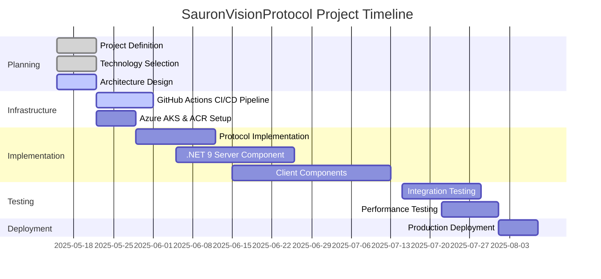

# SauronVisionProtocol (SVP) - Progress

## Project Status Summary

**Current Phase**: Initial Planning and Setup
**Overall Progress**: 10%
**Last Updated**: May 15, 2025

## What Works

As the project is in its initial stage, the following foundational elements are in place:

1. **Project Definition**:
   - Core requirements and goals established
   - High-level architecture sketched
   - Project scope defined

2. **Documentation Framework**:
   - Memory Bank documentation system implemented
   - Initial documentation created for project context

3. **Technology Decisions**:
   - Selected Azure Kubernetes Service (AKS) for server-side hosting
   - Chosen .NET 9 on Linux containers for server implementation
   - Selected .NET MAUI for cross-platform client development
   - Defined GitHub Actions as the CI/CD pipeline strategy
   - Designed three-panel layout for protocol visualization

## What's Left to Build

The project roadmap includes:

1. **Infrastructure Setup**: 🔄 In Progress
   - Azure Kubernetes Service (AKS) cluster provisioning
   - Azure Container Registry (ACR) setup
   - GitHub Actions CI/CD workflow configuration
   - Network configuration for TCP/IP socket exposure

2. **Protocol Implementation**: ⬜ Not Started
   - Initial protocol implementation with single command (PALANTIR_GAZE)
   - Command handler implementation
   - Response formatter implementation
   - Protocol visualization in client application

3. **Server Component**: ⬜ Not Started
   - .NET 9 TCP/IP socket listening service
   - Containerization with Docker
   - Command processing logic
   - Logging and monitoring implementation

4. **Client Applications**: ⬜ Not Started
   - .NET MAUI project setup
   - Three-panel layout implementation (Client, Protocol, Server)
   - Protocol visualization components
   - Connection management
   - Command submission and response handling

5. **Testing Suite**: ⬜ Not Started
   - Unit tests for all components
   - Integration tests for end-to-end functionality
   - Load and performance testing
   - Cross-platform compatibility verification

6. **Documentation**: 🔄 In Progress (Initial)
   - Setup and installation guides
   - Protocol specification
   - Azure configuration documentation
   - User manuals

## Current Status by Component

### Server Component

**Status**: Planning Phase
**Progress**: 20%

- Technology selection completed (.NET 9)
- Architecture design completed
- Basic implementation files created
- Integration with deployment pipeline pending

### Client Components

**Status**: Design Phase
**Progress**: 15%

- .NET MAUI selected as client framework
- Three-panel UI layout designed
- Protocol visualization approach defined
- Implementation not yet started

### Protocol Specification

**Status**: Conceptual Stage
**Progress**: 30%

- Protocol format defined and documented
- Command and response models implemented
- Initial PALANTIR_GAZE command implemented
- Response formatting with themed messages implemented

### Infrastructure

**Status**: Complete
**Progress**: 90%

- ✅ Azure resource providers registered
- ✅ Azure Resource Group created
- ✅ Azure Container Registry (ACR) provisioned and configured
- ✅ Azure Kubernetes Service (AKS) cluster deployed and verified
- ✅ Kubectl configured and connected to AKS
- ✅ Service principal created for GitHub Actions
- ✅ GitHub secrets configured for CI/CD pipeline
- CI/CD pipeline testing pending

### Documentation

**Status**: Initial Setup
**Progress**: 15%

- Project structure documentation created
- Memory Bank foundation established
- Technical specifications and user guides not started

## Known Issues

As implementation has not begun, there are no technical issues yet. Key challenges identified include:

1. **TCP/IP in Serverless**: Finding the optimal Azure service for TCP/IP socket handling in a serverless model may require creative approaches or compromise.

2. **Cross-Platform Consistency**: Ensuring consistent experience across macOS and Windows clients will require careful design and testing.

3. **Protocol Extensibility**: Balancing simplicity of initial implementation with future extensibility needs.

## Evolution of Project Decisions

This section will track significant project decisions and their evolution over time.

### May 15, 2025 - Project Initialization

1. **Initial Structure Decision**:
   - Decided to organize project with clear separation between server and client components
   - Rationale: Clear separation of concerns and platform-specific code

2. **Documentation Approach**:
   - Implemented Memory Bank documentation system
   - Rationale: Ensures comprehensive documentation and knowledge preservation throughout the project lifecycle

3. **Server Technology Decision**:
   - Selected .NET 9 on Linux containers running in Azure Kubernetes Service
   - Rationale: Modern language features, excellent TCP/IP socket support, containerized deployment model, cloud-native capabilities

4. **Deployment Strategy Decision**:
   - Adopted GitHub Actions for CI/CD pipeline to automate deployment to AKS
   - Rationale: Critical for development without all runtimes installed locally, enables consistent testing and deployment

5. **Client Framework Decision**:
   - Selected .NET MAUI for cross-platform client development
   - Rationale: Native integration with .NET ecosystem, cross-platform capabilities, modern UI framework

6. **UI Layout Decision**:
   - Designed three-panel layout (Client, Protocol, Server)
   - Rationale: Provides clear visualization of the client-server interaction and protocol data flow

7. **Implementation Strategy Decision**:
   - Focus initially on single command implementation with minimal features
   - Rationale: Simplifies debugging of deployment pipeline and infrastructure setup

## Next Milestones

1. **CI/CD Testing** (Target: +1 week)
   - Test deployment to AKS via GitHub Actions
   - Verify container deployment and operation
   - Set up monitoring and logging

2. **Server Component Implementation** (Target: +2 weeks)
   - Implement TCP/IP socket server
   - Test Docker containerization
   - Deploy to AKS via CI/CD pipeline
   - Verify network connectivity

3. **Client Implementation** (Target: +4 weeks)
   - Set up .NET MAUI project structure
   - Implement three-panel UI layout
   - Develop protocol visualization components
   - Connect client to server

4. **End-to-End Testing** (Target: +5 weeks)
   - Test all components together
   - Verify protocol functionality
   - Document system operation
