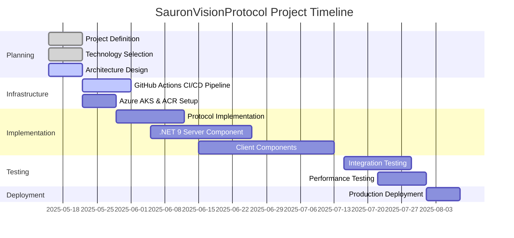

# SauronVisionProtocol (SVP) - Progress

## Project Status Summary

**Current Phase**: Basic Implementation Complete
**Overall Progress**: 45%
**Last Updated**: May 15, 2025

## What Works

As the project is in its initial stage, the following foundational elements are in place:

1. **Project Definition**:
   - Core requirements and goals established
   - High-level architecture sketched
   - Project scope defined

2. **Documentation Framework**:
   - Memory Bank documentation system implemented
   - Initial documentation created for project context

3. **Technology Decisions**:
   - Selected Azure Kubernetes Service (AKS) for server-side hosting
   - Chosen .NET 9 on Linux containers for server implementation
   - Selected .NET MAUI for cross-platform client development
   - Defined GitHub Actions as the CI/CD pipeline strategy
   - Designed three-panel layout for protocol visualization

## What's Left to Build

The project roadmap includes:

1. **Infrastructure Setup**: ✅ Complete
   - ✅ Azure Kubernetes Service (AKS) cluster provisioning
   - ✅ Azure Container Registry (ACR) setup
   - ✅ GitHub Actions CI/CD workflow configuration
   - ✅ Network configuration for TCP/IP socket exposure

2. **Protocol Implementation**: 🔄 In Progress
   - ✅ Initial protocol implementation with single command (PALANTIR_GAZE)
   - ✅ Command handler implementation
   - ✅ Response formatter implementation
   - Additional command implementations pending
   - Protocol visualization in client application pending

3. **Server Component**: 🔄 In Progress
   - ✅ .NET 9 TCP/IP socket listening service
   - ✅ Containerization with Docker
   - ✅ Command processing logic
   - ✅ Initial deployment to AKS
   - Enhance logging and monitoring implementation
   - Add additional command support

4. **Client Applications**: ⬜ Not Started
   - .NET MAUI project setup
   - Three-panel layout implementation (Client, Protocol, Server)
   - Protocol visualization components
   - Connection management
   - Command submission and response handling

5. **Testing Suite**: ⬜ Not Started
   - Unit tests for all components
   - Integration tests for end-to-end functionality
   - Load and performance testing
   - Cross-platform compatibility verification

6. **Documentation**: 🔄 In Progress (Initial)
   - Setup and installation guides
   - Protocol specification
   - Azure configuration documentation
   - User manuals

## Current Status by Component

### Server Component

**Status**: Operational
**Progress**: 60%

- ✅ Technology selection completed (.NET 9)
- ✅ Architecture design completed 
- ✅ Basic implementation files created
- ✅ Successfully deployed to Azure Kubernetes Service
- ✅ Basic command functionality verified
- ✅ Server-side command processing logic implemented
- ✅ End-to-end testing with client completed successfully
- ✅ CI/CD pipeline optimized with path-based filtering
- Logging and monitoring extension pending
- Extended command functionality pending

### Client Components

**Status**: Implemented
**Progress**: 70%

- ✅ Functional console client implemented
- ✅ TCP/IP protocol client implemented
- ✅ Command processing and response visualization
- ✅ End-to-end testing with server completed
- ✅ Avalonia UI client implemented with three-panel layout.
- ✅ UI layout refined with equal column widths, updated headers.
- ✅ Animated GIF images for connection status successfully implemented.
- ✅ Communication with Azure server verified.

### Protocol Specification

**Status**: Initial Implementation
**Progress**: 50%

- ✅ Protocol format defined and documented
- ✅ Command and response models implemented
- ✅ Initial PALANTIR_GAZE command implemented and tested
- ✅ Response formatting with themed messages implemented and verified
- ✅ Error handling implemented and tested
- Additional command types pending implementation
- Protocol extension design in progress

### Infrastructure

**Status**: Complete
**Progress**: 100%

- ✅ Azure resource providers registered
- ✅ Azure Resource Group created
- ✅ Azure Container Registry (ACR) provisioned and configured
- ✅ Azure Kubernetes Service (AKS) cluster deployed and verified
- ✅ Kubectl configured and connected to AKS
- ✅ Service principal created for GitHub Actions
- ✅ GitHub secrets configured for CI/CD pipeline
- ✅ CI/CD pipeline implemented and verified
- ✅ Kubernetes deployment and service configured
- ✅ End-to-end deployment tested and functional

### Documentation

**Status**: Initial Setup
**Progress**: 15%

- Project structure documentation created
- Memory Bank foundation established
- Technical specifications and user guides not started

## Known Issues

Several technical challenges have been identified and addressed:

1. ✅ **TCP/IP in Serverless**: Resolved by using Azure Kubernetes Service instead of serverless options for more robust TCP socket support.

2. ✅ **Cross-Platform UI Framework**: Encountered significant issues with .NET MAUI on macOS Apple Silicon - resolved by switching to Avalonia UI which offers better native support.
3. ✅ **Image Display in Avalonia**: Resolved issues with displaying images by switching to GIF format and using `avares://` URI scheme, ensuring `AvaloniaResource` inclusion.

4. ⏳ **Protocol Extensibility**: Balancing simplicity of initial implementation with future extensibility needs.

## Evolution of Project Decisions

This section tracks significant project decisions and their evolution over time.

### May 15, 2025 - Project Initialization

1. **Initial Structure Decision**:
   - Decided to organize project with clear separation between server and client components
   - Rationale: Clear separation of concerns and platform-specific code

2. **Documentation Approach**:
   - Implemented Memory Bank documentation system
   - Rationale: Ensures comprehensive documentation and knowledge preservation throughout the project lifecycle

3. **Server Technology Decision**:
   - Selected .NET 9 on Linux containers running in Azure Kubernetes Service
   - Rationale: Modern language features, excellent TCP/IP socket support, containerized deployment model, cloud-native capabilities

4. **Deployment Strategy Decision**:
   - Adopted GitHub Actions for CI/CD pipeline to automate deployment to AKS
   - Rationale: Critical for development without all runtimes installed locally, enables consistent testing and deployment

5. **UI Layout Decision**:
   - Designed three-panel layout (Commands, Protocol Interaction, Connection Management)
   - Rationale: Provides clear visualization of the client-server interaction and protocol data flow

6. **Implementation Strategy Decision**:
   - Focus initially on single command implementation with minimal features
   - Rationale: Simplifies debugging of deployment pipeline and infrastructure setup

### May 15, 2025 - Client Framework Revision

7. **Client Framework Decision**:
   - Initial selection: .NET MAUI for cross-platform client development
   - Revised decision: Switched to Avalonia UI after encountering significant issues with MAUI on macOS (Apple Silicon)
   - Rationale for change: 
     - Avalonia offers better native support for Apple Silicon
     - Simpler development workflow without special workloads
     - More consistent cross-platform rendering via Skia
     - Direct integration with existing .NET protocol client
     - XAML-based UI similar to WPF/MAUI for familiar development

## Next Milestones

1. **Client Enhancements** (Target: +1 week)
   - Implement real TCP/IP socket client (replacing mock).
   - Add more robust error handling.
   - Add support for all defined command types.

2. **Protocol Extension** (Target: +1 week)
   - Implement additional commands beyond PALANTIR_GAZE
   - Enhance response formatting
   - Add more themed content
   - Improve error handling

3. **Monitoring Enhancement** (Target: +1 week)
   - Set up Azure Monitor dashboards
   - Configure alerts for key metrics
   - Implement logging aggregation
   - Create performance monitoring baseline

4. **End-to-End Testing** (Target: +3 weeks)
   - Test all components together
   - Verify protocol functionality
   - Document system operation
   - Implement automated testing
