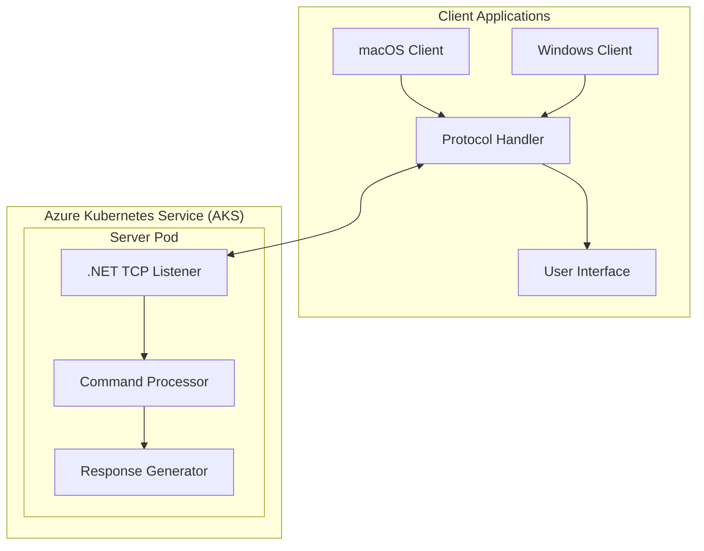
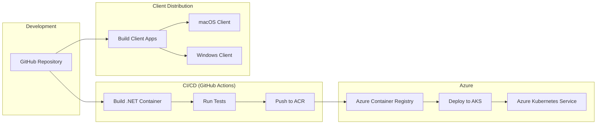

# SauronVisionProtocol (SVP) - System Patterns

## System Architecture

The SauronVisionProtocol system follows a client-server architecture with the following high-level components:



### Key Components

1. **Protocol Handler**: Implements the SVP protocol, handling the encoding/decoding of commands and responses between client UI and server.

2. **User Interface**: Platform-specific GUI implementations that provide consistent experience across supported platforms.

3. **.NET TCP Listener**: Component running on AKS that establishes and maintains TCP/IP socket connections using .NET 9's networking capabilities.

4. **Command Processor**: Interprets incoming commands according to the SVP specification.

5. **Response Generator**: Creates themed responses based on the processed commands.

## Design Patterns

1. **Command Pattern**: Used for encapsulating requests as objects, allowing for parameterization of clients with different requests and queue or log operations.

```
CommandInvoker (Client) -> Command Interface -> ConcreteCommand -> CommandReceiver (Server)
```

2. **Factory Pattern**: For creating platform-specific UI components while maintaining a consistent interface.

3. **Adapter Pattern**: To integrate with various Azure services and potentially different network libraries across platforms.

4. **Observer Pattern**: For UI updates based on connection status and command responses.

5. **Strategy Pattern**: For different command processing strategies on the server side.

## Communication Flow

1. Client establishes TCP/IP connection to server
2. Server acknowledges connection
3. Client sends command according to SVP format
4. Server processes command
5. Server generates response
6. Client receives and displays response
7. Connection remains open for additional commands (persistent connection model)

## Component Relationships

### Client Side

- **Platform Layer**: Contains platform-specific implementations (macOS/Windows)
  - Responsible for native UI rendering
  - Handles OS-specific networking considerations
  
- **Protocol Layer**: Platform-agnostic implementation of SVP
  - Handles command formatting and transmission
  - Processes received responses
  - Manages connection state

- **UI Layer**: Presents themed interface to users
  - Displays connection status
  - Provides command input mechanisms
  - Renders server responses

### Server Side

- **Listener Layer**: Accepts and manages TCP/IP connections
  - Implements socket handling
  - Manages connection lifecycle
  
- **Processing Layer**: Interprets and executes commands
  - Validates command format
  - Executes business logic based on command type
  
- **Response Layer**: Generates themed responses
  - Formats data according to protocol
  - Adds thematic elements to responses

## Technical Implementation Paths

### Azure Implementation Strategy

The project utilizes Azure Kubernetes Service (AKS) for the server-side implementation, with all infrastructure now successfully provisioned:

1. **Azure Kubernetes Service (AKS)** - ✅ Implemented:
   - Two-node cluster deployed with Standard_B2s VM size
   - Resource group: sauron-vision-protocol-rg
   - Cluster name: sauron-vision-protocol-aks
   - Leverages managed identity for secure access
   - Kubectl connected and verified with both nodes showing "Ready" status
   - Kubernetes version v1.31.7 deployed

2. **Azure Container Registry (ACR)** - ✅ Implemented:
   - Registry name: sauronvisionacr
   - Basic SKU for cost efficiency
   - Admin access enabled
   - Attached to AKS for pull access
   - Ready to store Docker container images for server components

3. **.NET 9 on Linux Containers**:
   - Server container implementation ready for deployment
   - Docker container configuration defined in Dockerfile
   - Kubernetes deployment manifests prepared
   - Implementation leverages .NET's TCP/IP socket capabilities

The implementation follows cloud-native best practices with infrastructure-as-code and prepared automated deployment processes. All Azure resources have been successfully provisioned and are ready for application deployment.

### Client Implementation Options

1. **Electron**:
   - Pros: Cross-platform, web technologies, rapid development
   - Cons: Resource usage, package size

2. **Flutter**:
   - Pros: Cross-platform, native performance, single codebase
   - Cons: Learning curve, relatively new for desktop

3. **Native Applications** (Swift for macOS, C#/WPF for Windows):
   - Pros: Best platform integration, performance
   - Cons: Separate codebases, higher maintenance

4. **React Native**:
   - Pros: JavaScript ecosystem, code sharing
   - Cons: Desktop support less mature than mobile

Initial client implementation approach to be determined based on team expertise and specific requirements.

## Protocol Design

SVP follows a text-based protocol format for simplicity of implementation and debugging, now implemented in the shared protocol models:

### Command Format - ✅ Implemented

Commands follow this format:
```
[COMMAND_NAME] [PARAM1] [PARAM2] ... [PARAMn]
```

Commands are Lord of the Rings/Sauron-themed. Currently implemented:

```
PALANTIR_GAZE [location]    # Directs the Eye of Sauron's gaze to a specific location
```

Planned future commands:
```
EYE_OF_SAURON [intensity] [duration]    # Controls the intensity of the gaze
RING_COMMAND [minion_type] [action]     # Commands minions to perform actions
```

### Response Format - ✅ Implemented

Responses follow this format:
```
[STATUS_CODE] [RESPONSE_TYPE] "[MESSAGE]"
```

Status codes:
- `200`: Success
- `500`: Error

Response types:
- `VISION_GRANTED`: The Eye of Sauron successfully directed its gaze
- `VISION_DENIED`: The Eye of Sauron could not or would not direct its gaze

Example:
```
200 VISION_GRANTED "The eye of Sauron turns to gondor. Armies of 5,000 orcs detected. The white city stands vulnerable."
```

A full protocol specification has been documented in `docs/protocol/specification.md` and implemented in the `shared/protocol/Models/` directory with Command and Response classes.

## Deployment Architecture



This deployment architecture implements a fully automated CI/CD pipeline through GitHub Actions. When changes are pushed to the repository:

1. GitHub Actions automatically builds the Docker container for the server component
2. Runs automated tests to verify functionality
3. Pushes the container image to Azure Container Registry (ACR)
4. Updates the deployment on Azure Kubernetes Service (AKS)

This approach provides:
- Consistent, repeatable deployments
- Version control for both code and container images
- Automated testing as part of the deployment pipeline
- Scalable infrastructure management through Kubernetes
- Separation between server-side and client-side deployment processes

Since development will be primarily on macOS without all runtimes installed locally, this pipeline is essential for testing and deployment.
