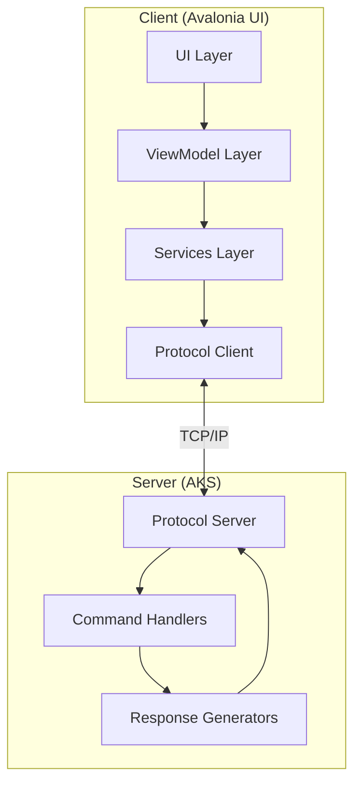
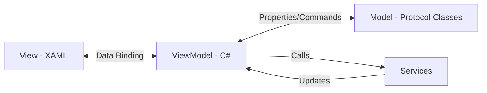
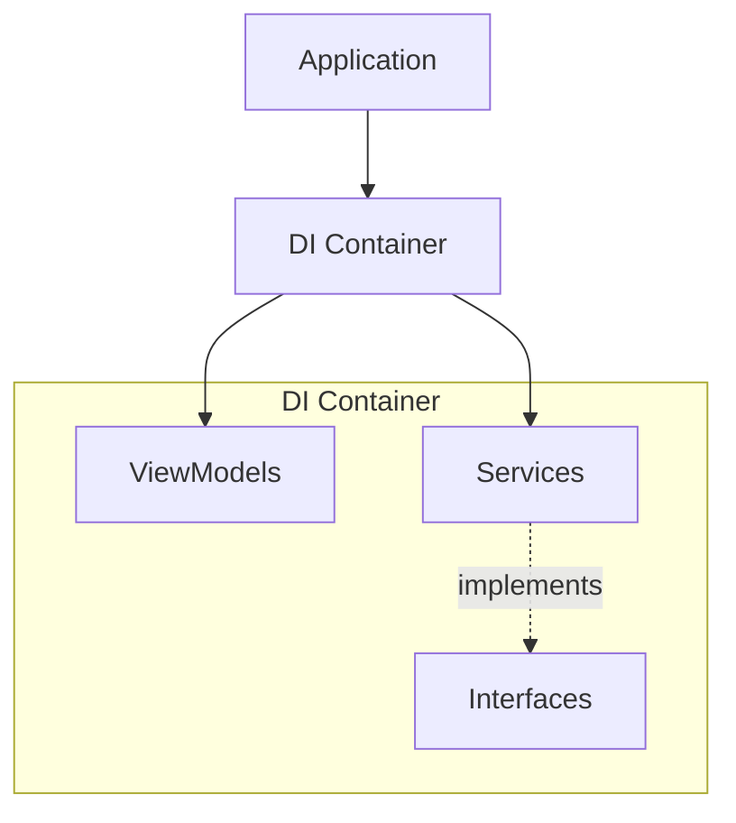
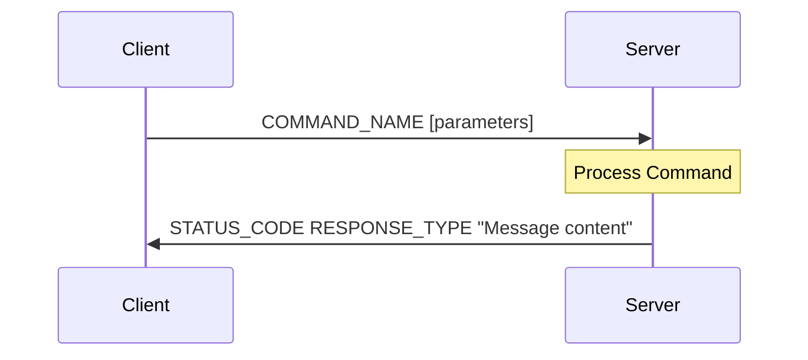
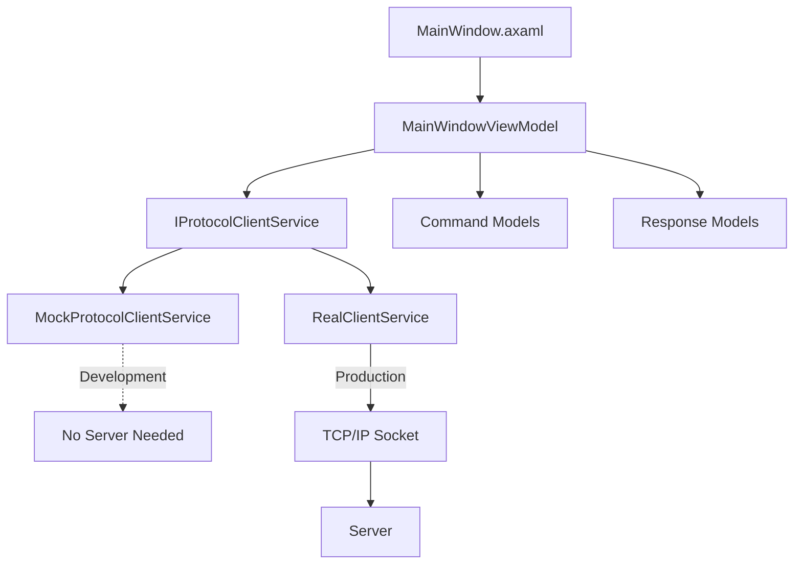
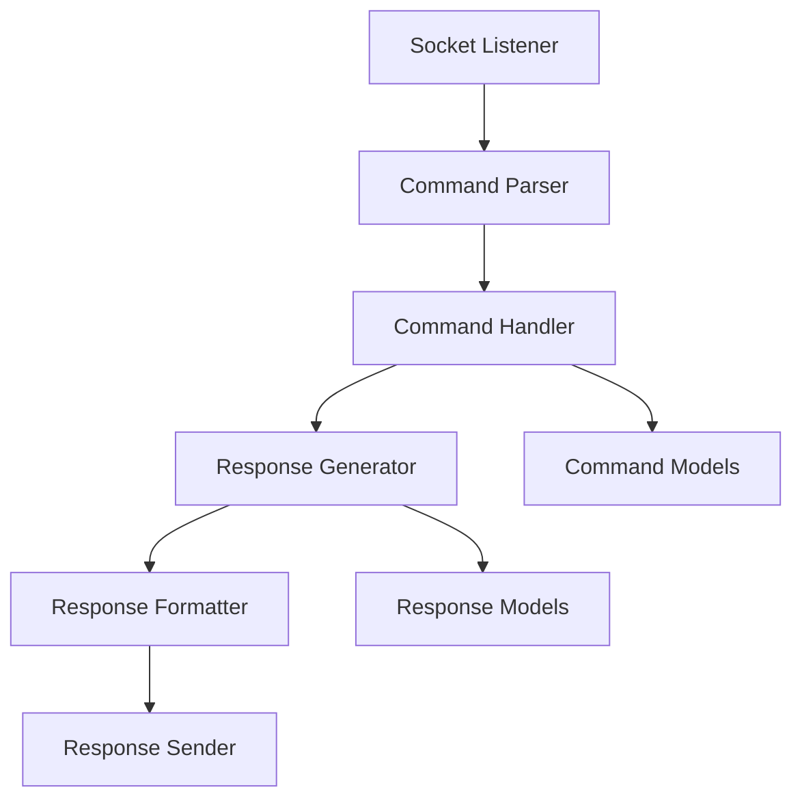
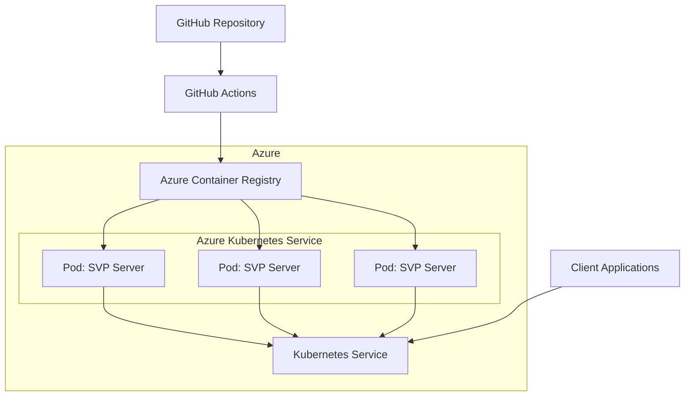

# SauronVisionProtocol (SVP) - System Patterns

## System Architecture

SauronVisionProtocol follows a client-server architecture with a custom TCP/IP protocol for communication.

### Key Components

1. **Protocol Layer**:
   - Shared protocol definition (.NET library)
   - Text-based command and response format
   - Command models (PALANTIR_GAZE, EYE_OF_SAURON, RING_COMMAND)
   - Response models with status codes and themed messages

2. **Client Components**:
   - UI Layer (Avalonia XAML)
   - ViewModels (ReactiveUI/MVVM)
   - Services (Socket Communication)
   - Protocol Client (TCP/IP implementation)

3. **Server Components**:
   - Socket Listener
   - Command Processor
   - Response Formatter
   - Error Handler

## Design Patterns

### MVVM Architecture (Client)

The client follows the Model-View-ViewModel pattern for clean separation of concerns:

1. **View Layer**:
   - Avalonia XAML UI components
   - Data binding to ViewModels
   - Minimal code-behind
   - Three-panel layout (Commands, Protocol Interaction, Connection)

2. **ViewModel Layer**:
   - Observable properties
   - Command bindings
   - Data transformation
   - Service coordination
   - CommunityToolkit.Mvvm and ReactiveUI

3. **Model Layer**:
   - Protocol data models
   - Shared between client and server
   - Serialization logic

4. **Services Layer**:
   - IProtocolClientService interface
   - MockProtocolClientService (for development)
   - Actual TCP implementation (to be implemented)

### Dependency Injection

1. **Service Registration**:
   - Microsoft.Extensions.DependencyInjection
   - Registered in App.xaml.cs
   - Singleton services for application lifetime

2. **Constructor Injection**:
   - ViewModels receive services via constructor
   - Services are interface-based for testability
   - Mock implementations for development

3. **Service Locator Pattern Avoidance**:
   - Direct injection rather than service location
   - Clear dependencies specified at class level

### Protocol Design

1. **Text-Based Format**:
   - Human-readable commands and responses
   - Space-delimited parameters
   - Quoted message strings
   - Status codes similar to HTTP (200, 400, 500)

2. **Command Format**:
   - Command name in uppercase
   - Optional parameters separated by spaces
   - Example: `PALANTIR_GAZE gondor`

3. **Response Format**:
   - Status code (200 for success, 400/500 for errors)
   - Response type in uppercase
   - Message content in quotes
   - Example: `200 VISION_GRANTED "The eye of Sauron turns to gondor. Armies detected."`

## Component Relationships

### Client Stack

### Server Stack

## Critical Implementation Paths

### Protocol Communication Flow

1. **Client Connection Establishment**:
   - TCP socket connection to server IP/port
   - No authentication in initial implementation
   - Connection state management

2. **Command Submission**:
   - Client formats command string
   - Command sent over TCP socket
   - Server receives and parses command

3. **Command Processing**:
   - Server identifies command type
   - Appropriate handler processes command
   - Response generated based on command

4. **Response Handling**:
   - Server formats response string
   - Response sent over TCP socket
   - Client receives and parses response
   - UI updated to display response

### Error Handling Strategy

1. **Connection Errors**:
   - Connection timeouts
   - Connection refused
   - Connection lost during operation
   - Retry logic with exponential backoff

2. **Protocol Errors**:
   - Malformed commands
   - Unknown commands
   - Invalid parameters
   - Status codes with error descriptions

3. **Server Errors**:
   - Internal processing errors
   - Resource limitations
   - Exception handling and logging

## Security Considerations

While security is limited in the initial proof-of-concept, some key considerations are:

1. **No Authentication**:
   - Initial implementation has no authentication
   - Potential future enhancement

2. **No Encryption**:
   - Traffic is unencrypted
   - Not suitable for sensitive information
   - Could be enhanced with TLS in future

3. **Input Validation**:
   - All client inputs must be validated
   - Parameter sanitization on server side
   - Protection against malformed requests

4. **Error Information Leakage**:
   - Careful control of error details
   - No stack traces or sensitive information in responses

## Performance Patterns

1. **Asynchronous Communication**:
   - Non-blocking I/O operations
   - Async/await pattern throughout
   - UI responsiveness maintained during network operations

2. **Connection Pooling** (future):
   - Reuse connections for multiple commands
   - Reduce connection establishment overhead

3. **Efficient Parsing**:
   - Minimal string operations
   - Optimized parsing logic
   - Reusable message objects

## Deployment Architecture

1. **Containerization Strategy**:
   - .NET 9 server in Docker container
   - Linux-based container
   - Minimal image size
   - Configuration via environment variables

2. **Kubernetes Deployment**:
   - Deployment manifest defines replicas
   - Service exposes TCP port
   - ConfigMap for configuration
   - Resource limits defined

3. **CI/CD Pipeline**:
   - GitHub Actions workflow
   - Build and test
   - Push to Azure Container Registry
   - Deploy to Azure Kubernetes Service
   - Automated validation

## Design Decisions

### Why Avalonia UI?

- **Decision**: Use Avalonia UI instead of .NET MAUI for the client application.
- **Rationale**: 
  - Better native support for Apple Silicon (ARM64)
  - More consistent cross-platform rendering via Skia
  - No platform-specific workloads required
  - XAML-based UI familiar to WPF/.NET developers
- **Alternatives Considered**:
  - .NET MAUI: Rejected due to Apple Silicon issues
  - Electron: Rejected due to performance and bundling concerns
  - Platform-specific clients: Rejected due to code duplication

### Why Azure Kubernetes Service?

- **Decision**: Use AKS rather than Azure Functions or App Service.
- **Rationale**:
  - Better support for TCP socket handling
  - Custom container deployment
  - Potential for scaling
  - Managed Kubernetes simplifies operations
- **Alternatives Considered**:
  - Azure Functions: Rejected due to HTTP focus and socket limitations
  - Azure App Service: Rejected due to TCP socket constraints
  - Azure Container Instances: Viable but less scalable

### Why Text-Based Protocol?

- **Decision**: Implement a text-based rather than binary protocol.
- **Rationale**:
  - Easier debugging and development
  - Human-readable for educational purposes
  - Simpler extension and documentation
  - More aligned with the proof-of-concept nature
- **Alternatives Considered**:
  - Binary protocol: More efficient but harder to debug
  - JSON/XML: More verbose without significant benefits for this use case
